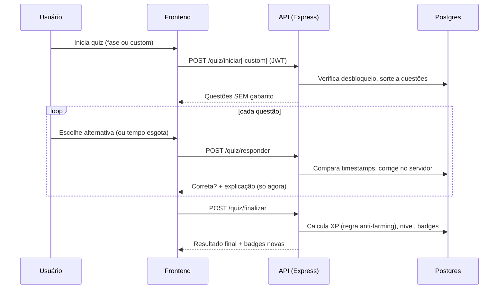

# Arquitetura

## Visão geral

```mermaid
flowchart LR
    subgraph Cliente
        B[Navegador]
    end

    subgraph Vercel
        F["Frontend<br/>React + Vite (estático)"]
        A["Backend<br/>Express (função serverless)"]
    end

    subgraph Supabase
        Auth["Supabase Auth<br/>(login/cadastro)"]
        DB[("PostgreSQL<br/>RLS habilitado, sem policies")]
    end

    B -->|carrega o app| F
    B -->|login/cadastro (JWT)| Auth
    F -->|"fetch /api/* + Bearer JWT"| A
    A -->|valida o JWT (anon key)| Auth
    A -->|"lê/escreve (service_role, ignora RLS)"| DB
    F -.->|"apenas auth, nunca lê dados direto"| Auth
```

## Decisões de arquitetura

- **Autenticação única via Supabase Auth** — não há senha no banco da aplicação;
  `profiles.id` referencia `auth.users.id` e um trigger (`handle_new_user`) cria o
  perfil no cadastro.
- **Lógica de jogo 100% no servidor** — correção de respostas, cálculo de XP,
  concessão de badges e desbloqueio de fases são calculados pelo Express. O
  frontend nunca recebe qual alternativa é a correta antes de responder
  (ver `backend/src/services/quizService.js`).
- **RLS habilitado sem policies** — o frontend usa a `anon key` apenas para
  autenticar (login/cadastro/sessão) via `frontend/src/lib/supabase.js`; ela
  nunca lê tabelas de dados diretamente. Toda leitura/escrita de dados passa
  pela API Express, que usa a `service_role key` (ignora RLS). Isso significa
  que RLS aqui é uma segunda barreira, não a primeira: mesmo que a anon key
  vaze, ela não consegue ler `questoes`, `tentativas` etc.
- **Ranking é view, não tabela** — posição é derivada de `xp_total` com
  `RANK() OVER` (`database/02_views.sql`), eliminando inconsistência entre
  o valor armazenado e a posição exibida.
- **Histórico granular** — `tentativas` (1 por quiz) e `respostas` (1 por
  questão, com tempo de resposta) alimentam os relatórios do professor
  (`desempenho_questoes`, `desempenho_alunos`).
- **Anti-farming de XP** — repetir uma fase ou quiz só rende o XP que
  _exceder_ o melhor desempenho anterior na mesma origem
  (`melhorXpBrutoAnterior` em `quizService.js`), evitando fazer XP infinito
  respondendo o mesmo quiz várias vezes.
- **Backend serverless na Vercel** — o Express roda como função serverless
  (`backend/api/index.js` reexporta o `app`), não como processo long-running.
  Isso implica cold starts ocasionais e ausência de estado em memória entre
  requisições (nada é cacheado no processo Node).

## Fluxo de uma tentativa de quiz



## Camadas do código

| Camada      | Pasta                      | Responsabilidade                                                                                |
| ----------- | -------------------------- | ----------------------------------------------------------------------------------------------- |
| Rotas       | `backend/src/routes/`      | Mapeiam método+caminho para um controller. Todas exigem JWT (`autenticar`), exceto `/health`.   |
| Controllers | `backend/src/controllers/` | Recebem `req`, validam formato básico, delegam ao service, formatam a resposta.                 |
| Services    | `backend/src/services/`    | Regras de negócio: quiz, XP, badges, ranking, relatórios. Onde a lógica de jogo realmente vive. |
| Config      | `backend/src/config/`      | Variáveis de ambiente validadas no boot (`env.js`) e os dois clientes Supabase (`supabase.js`). |

No frontend, `src/services/api.js` é o único ponto que fala com a API (injeta o JWT em cada
requisição); `src/lib/supabase.js` é o único ponto que fala com o Supabase Auth diretamente.
