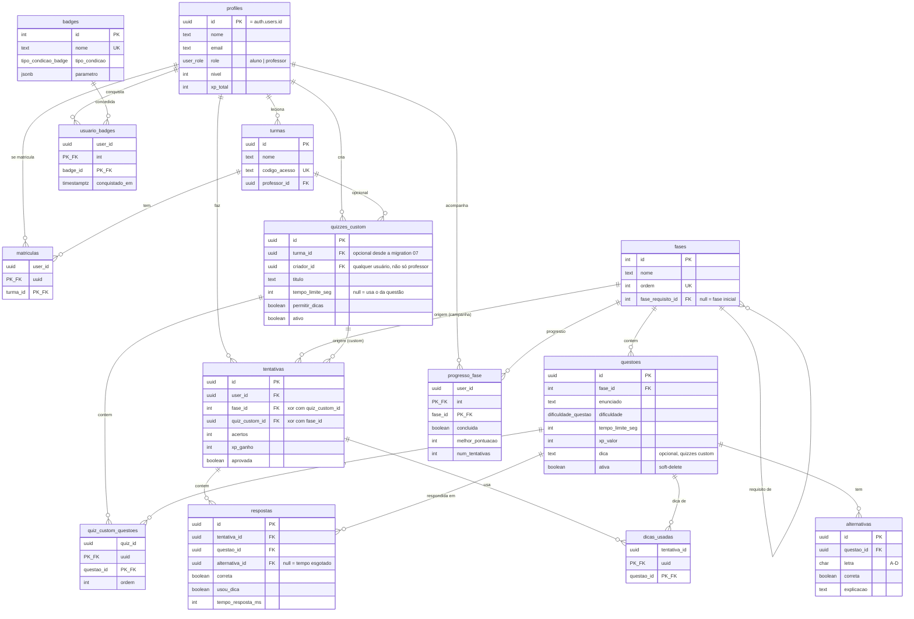

# Modelo de dados

Gerado a partir de `database/01_schema.sql`, `06_quiz_custom_dicas.sql` e
`07_quizzes_abertos.sql`. Para recriar o schema do zero, rode os scripts de
`database/` em ordem no SQL Editor do Supabase.

## Pontos que não são óbvios olhando só o diagrama

- **`tentativas` tem origem XOR**: exatamente um entre `fase_id` e
  `quiz_custom_id` é preenchido (constraint `tentativa_origem`). Uma tentativa
  nunca pertence às duas coisas.
- **`alternativas` garante no máximo uma correta por questão** via índice
  parcial único (`uma_correta_por_questao`), não por trigger.
- **`quizzes_custom.turma_id` é opcional** desde `07_quizzes_abertos.sql` —
  antes dessa migration, quizzes custom só existiam dentro de uma turma
  criados pelo professor (`professor_id`). Hoje qualquer usuário cria um quiz
  (`criador_id`) e ele fica disponível a todos, com ou sem turma associada.
  Código ou UI que assuma "quiz = pertence a uma turma" está desatualizado.
- **`questoes.ativa`** é soft-delete: desativar uma questão a tira dos novos
  quizzes mas preserva `respostas` já registradas (histórico não é apagado).
- **Nível e ranking não são armazenados como fonte de verdade separada** —
  `profiles.nivel`/`xp_total` são atualizados a cada `finalizar` de quiz, mas
  a _posição_ no ranking é sempre calculada on-the-fly pelas views
  `ranking_global` / `ranking_turma` / `ranking_fase` (`RANK() OVER`), nunca
  lida de uma coluna.
